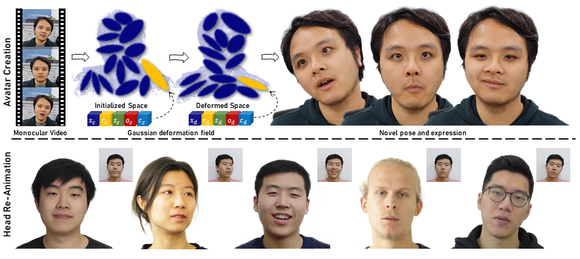

# Monogaussianavatar: Monocular gaussian point-based head avatar
## [Paper](https://dl.acm.org/doi/abs/10.1145/3641519.3657499) | [Video Youtube](https://www.youtube.com/embed/3UvBkyPc-oc) | [Project Page](https://yufan1012.github.io/MonoGaussianAvatar)
[Yufan Chen](https://yufan1012.github.io/)<sup>&dagger;,1</sup>, [Lizhen Wang](https://lizhenwangt.github.io/)<sup>2</sup>, [Qijing Li](https://www.liuyebin.com/student.html)<sup>2</sup>, [Hongjiang Xiao](https://www.semanticscholar.org/author/Hongjiang-Xiao/2747760)<sup>3</sup>, [Shengping Zhang](http://homepage.hit.edu.cn/zhangshengping)<sup>*,1</sup>, [Hongxun Yao](http://homepage.hit.edu.cn/yaohongxun))<sup>1</sup>, [Yebin Liu](http://www.liuyebin.com))<sup>2</sup>

<p><sup>1</sup>Harbin Institute of Technology &nbsp;&nbsp;<sup>2</sup>Tsinghua Univserity &nbsp;&nbsp;<sup>3</sup>Communication University of China
<br><sup>*</sup>Corresponding author &nbsp;&nbsp;<sup>&dagger;</sup>Work done during an internship at Tsinghua Univserity<p>


Official Repository for paper [*Monogaussianavatar: Monocular gaussian point-based head avatar*](https://dl.acm.org/doi/abs/10.1145/3641519.3657499). 
 
## Getting Started
* Create a conda or python environment and activate. For e.g., `conda create -n monogshead python=3.9; conda activate monogshead`.
* Install PyTorch 1.11.0 with `conda install pytorch==1.11.0 torchvision==0.12.0 torchaudio==0.11.0 cudatoolkit=11.3 -c pytorch`. This version works with both PyTorch3d and functorch.
* Install PyTorch3d:
```
conda install -c fvcore -c iopath -c conda-forge fvcore iopath
conda install pytorch3d
```
* Install other requirements: `cd ../monogaussianavatar; pip install -r requirement.txt; pip install -U face-detection-tflite`
* Install gaussian rasterization: 
```
cd submodules/
git clone https://github.com/graphdeco-inria/gaussian-splatting --recursive
cd gaussian-splatting/
pip install -e submodules/diff-gaussian-rasterization
cd ..
```
* Install realtime requirements: `cd ../monogaussianavatar; pip install -r requirement_realtime.txt`

* Download [FLAME model](https://flame.is.tue.mpg.de/download.php), choose **FLAME 2020** and unzip it, copy 'generic_model.pkl' into `./code/flame/FLAME2020`
## Preparing dataset
Our data format is the same as [IMavatar](https://github.com/zhengyuf/IMavatar/). You can download a preprocessed dataset from [Google drive](https://drive.google.com/file/d/1Hzv41ZkpMK1X9h9Z-B54S-Nn1GcMveb8/view?usp=sharing) (subject 1 and 2)

If you'd like to generate your own dataset, please follow intructions in the [IMavatar repo](https://github.com/zhengyuf/IMavatar/tree/main/preprocess).

Link the dataset folder to `./data/datasets`. Link the experiment output folder to `./data/experiments`.

## Pre-trained model
Download a pretrained model from .
Uncompress and put into the experiment folder `./data/experiments`.
## Training
```
python scripts/exp_runner.py ---conf ./confs/subject1.conf [--is_continue]
```
## Evaluation
Set the *is_eval* flag for evaluation, optionally set *checkpoint* (if not, the latest checkpoint will be used) and *load_path* 
```
python scripts/exp_runner.py --conf ./confs/subject1.conf --is_eval [--checkpoint 60] [--load_path ...]
```
## GPU requirement
We train our models with a single Nvidia 24GB RTX3090 GPU.
## Citation
If you find our code or paper useful, please cite as:
```
@inproceedings{chen2024monogaussianavatar,
  title={Monogaussianavatar: Monocular gaussian point-based head avatar},
  author={Chen, Yufan and Wang, Lizhen and Li, Qijing and Xiao, Hongjiang and Zhang, Shengping and Yao, Hongxun and Liu, Yebin},
  booktitle={ACM SIGGRAPH 2024 Conference Papers},
  pages={1--9},
  year={2024}
}
```
